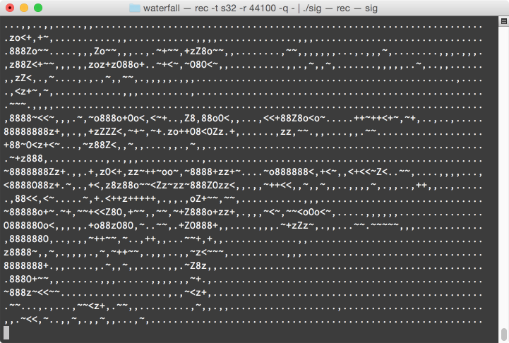

# Waterfall plot on terminal
Another thing I found on my hard drive: following old ideals, I also wanted a cool C signature. Sadly, mine is not entirely independent, and it needs `sox`'s `rec` binary.

`sig.c` contains the compressed C code, `waterfall.c` the original.

## Explanation
A waterfall plot the change of a spectrum over time. This one records audio from your microphone, calculates the spectrum via FFT and displays the result in near-real time on your terminal. When you run the application and whistle a long ascending note, you can actually see the curve on the plot.

## Compile and run
    brew install sox
    make
    rec -t s32 -r 44100 -q - | ./sig
    

